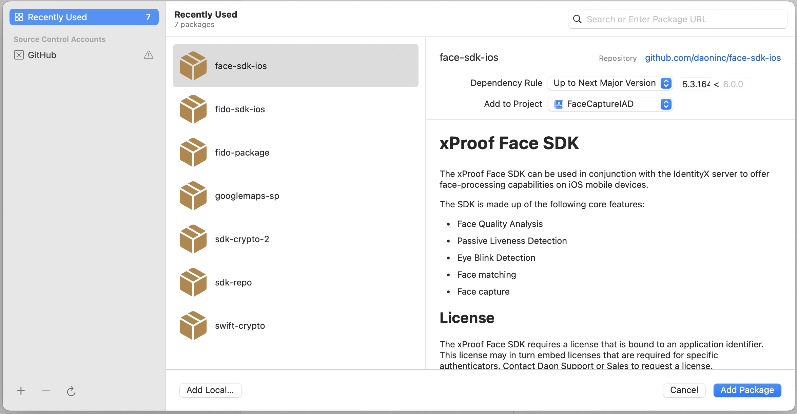

# xProof Face SDK

The xProof Face SDK can be used in conjunction with the IdentityX server to offer face-processing capabilities on iOS mobile devices.

The SDK is made up of the following core features:

- Face Quality Analysis
- Passive Liveness Detection
- Eye Blink Detection
- Head Movement Detection (nod and shake)
- Light Reflection Liveness Detection
- Face matching
- Face capture

## License
The xProof Face SDK requires a license that is bound to an application identifier. This license may in turn embed licenses that are required for specific authenticators. Contact Daon Support or Sales to request a license.

## Samples

The demo sample includes the following:

- **Passive Liveness** Provides a reference implementation of Best Practices using Passive Liveness and blink detection.

- **Passive Liveness V2** A sample that demonstrates the Daon Passive Liveness V2 algorithm.

- **Quality** Live and still image quality and face finding demo.

- **FaceCaptureIFP** Demonstrates how to use the face Capture API to capture an image for enrollment and verification. The Capture API supports injection attack prevention when used in conjunction with the IdentityX server.

## Swift Package
Add your GitHub account to Xcode and add the Face SDK as a Swift Package.




## API

### Initialize

```swift
let daonFace = DaonFaceSDK()

daonFace?.addAnalyzer(DFSQualityAnalyzer())
daonFace?.addAnalyzer(DFSLivenessBlinkAnalyzer())
daonFace?.addAnalyzer(DFSLivenessAnalyzer())
```


### Analyze a bitmap
Analyze image quality and extract faces from a bitmap.

```swift
let daonFace = DaonFaceSDK()
daonFace?.add(analyzer: DFSQualityAnalyzer())

let res = daonFace?.analyzeSingleImage(image)

let faces = daonFace?.analyzeFaces(image: image, options: .searchAllOrientations)
```


### Analyze a video stream
Analyzes an image buffer from a live camera feed. This method is asynchronous and provides the result in a block.

```swift
daonFace?.analyze(pixelBuffer) { result in
    process(result)
}
```


### Face Capture API
The face capture API is responsible for capturing images for enrollment and verification. The API will handle the camera and preview and supports injection attack prevention when used in conjunction with the IdentityX server. 

The Capture API supports medical mask detection, device upright detection and quality assessment.

```swift
controller = DFSCameraController()
```

```swift
var controller = DFSCameraController()

// Set options
controller.setQuality(DFSCameraController.Quality.low)
controller.setMedicalMaskDetection(true)
controller.setDeviceUprightDetection(true)
controller.setConfirmation(true)

// Start capture
controller.startCapture(controller: self, completion: { image, data, error in

    if let error {
        self.messageLabel.text = "Error: \(error.localizedDescription)"
        self.controller.stopCapture()
    } else if let img = image, let payload = data {
        self.imageView.image = img
        self.messageLabel.text = "Payload: \(payload)"    
        self.controller?.setCaptureCompleted(message: "Success")
    } else {
        self.controller?.setCaptureFailed(message: "Failed", allowRetake: true) {
            print("capture completed")
        }
    }    

})
```


See the [xProof Face SDK Documentation](https://developer.identityx-cloud.com/client/face/ios/) for more information.    

